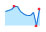
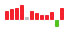
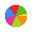

# sparklines
> 迷你图

## Status: Pre-Alpha.

- 公共参数

| 完成度 | 描述 | 参数 | 类型 | 可选值 | 默认值 | 
| ----- | ---- | ---- | ---- | ---- | ---- |
| &#9745; | 设置宽度 | width | number | 无 | 'auto' |
| &#9745; | 设置高度 | height | number | 无 | 'auto' |
| &#9745; | 设置类型 | type | number | `line` | 'auto' |
| &#9745; | 数据可配置 | values | number[] | 无 | [] |
| &#9745; | 图表内上下左右的边距 | padding | number | 无 | 0 |
| &#9744; | 设置为true可禁用所有迷你图交互 | disableInteraction | boolean | 无 | false |
| &#9744; | 如果为true，则提供给图的y值将被裁剪为介于chartRangeMin和chartRangeMax之间-默认情况下，chartRangeMin / Max仅确保图表至少跨越了该值范围，但不对其进行限制 | chartRangeClip | boolean | 无 | false |
| &#9744; | 指定用于图表的Y值范围的最小值-默认为所提供的最小值 | chartRangeMin | number | 无 | 无 |
| &#9744; | 指定用于图表的Y值范围的最大值-默认为所提供的最大值 | chartRangeMax | number | 无 | 无 |

- 折线图(`type = 'line'`)

| 完成度 | 描述 | 参数 | 类型 | 可选值 | 默认值 | 
| ----- | ---- | ---- | ---- | ---- | ---- |
| &#9745; | 线的宽度 | lineWidth | number | 无 | 1 |
| &#9745; | 线的颜色，为空的时候没有颜色，默认： 佛晓蓝7 | lineColor | string | 无 | '#096dd9' |
| &#9745; | 填充的颜色，为空的时候没有颜色，默认：佛晓蓝2 | fillColor | string | 无 | '#bae7ff' |
| &#9745; | 所有点标记的半径，以像素为单位 | spotRadius | number | 无 | 1 |
| &#9745; | 图表中每个值的默认宽度均为3像素 | defaultPixelsPerValue | number | 无 | 3 |
| &#9745; | 最终值标记的CSS颜色。设置为空字符串将其隐藏，默认： 薄暮6 | spotColor | string | 无 | '#f5222d' |
| &#9745; | 为最小值显示的标记的CSS颜色。设置为false或空字符串以将其隐藏，默认： 薄暮6 | minSpotColor | boolean | 无 | '#f5222d' |
| &#9745; | 为最大值显示的标记的CSS颜色。设置为false或空字符串以将其隐藏，默认： 薄暮6 | maxSpotColor | boolean | 无 | '#f5222d' |
| &#9744; | 指定当鼠标悬停在值上时显示在该值上的斑点的颜色。设置为空以禁用。 | highlightSpotColor | string | 无 | '#5f5' |
| &#9744; | 为鼠标悬停时通过值显示的垂直线指定颜色。设置为null以禁用。 | highlightLineColor | string | 无 | '#f22' |

- 柱状图(`type = 'bar'`)

| 完成度 | 描述 | 参数 | 类型 | 可选值 | 默认值 | 
| ----- | ---- | ---- | ---- | ---- | ---- |
| &#9745; | 正数的颜色， 默认： 薄暮 | barColor | string | 无 | '#f5222d' |
| &#9745; | 负数的颜色， 默认：极光绿 | negBarColor | string | 无 | '#52c41a' |
| &#9745; | 0 的颜色，默认：灰色 | zeroColor | string | 无 | '#bfbfbf' |
| &#9745; | 柱子的宽度 | barWidth | number | 无 | 4 |
| &#9745; | 柱子的间距 | barSpacing | number | 无 | 1 |
| &#9745; | 是否正负数两级分开显示 | zeroAxis | boolean | 无 | true |

- 饼图(`type = 'pie'`)

| 完成度 | 描述 | 参数 | 类型 | 可选值 | 默认值 | 
| ----- | ---- | ---- | ---- | ---- | ---- |
| &#9745; | 围绕整个饼图绘制的边框宽度（以像素为单位） | borderWidth | number | 无 | 0 |
| &#9745; | 以度为单位的角度以偏移第一个切片，尝试 -90 或 90 | offset | number | 无 | 0 |
| &#9745; | 用于饼图的CSS颜色数组，默认： [日暮, 青柠, 法式洋红, 佛晓蓝, 薄暮, 金盏花, 极光绿, 极客蓝, 火山, 日出, 明青, 酱紫] | sliceColors | string[] | 无 | ['#fa8c16','#a0d911','#eb2f96','#1890ff', '#f5222d','#faad14', '#52c41a', '#2f54eb', '#fa541c','#fadb14','#13c2c2','#722ed1',] |
| &#9745; | 用于绘制饼图边框的CSS颜色 | borderColor | string | 无 | '#000' |
